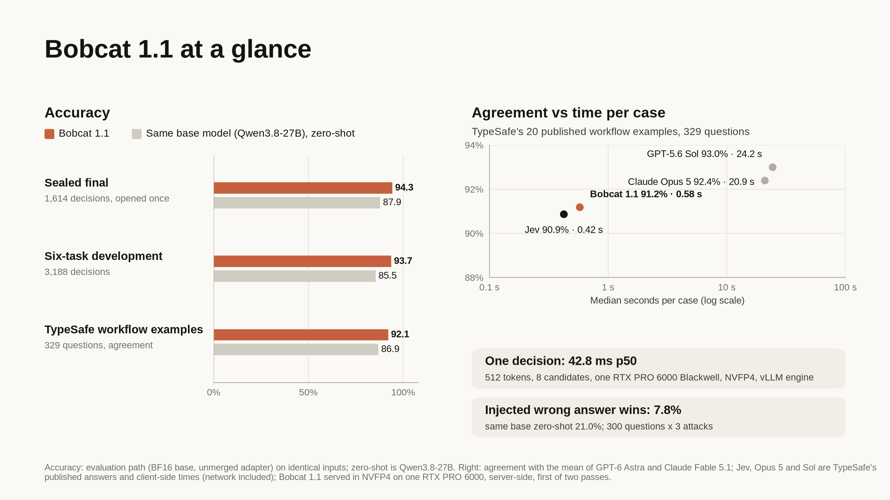

<p align="center">
  <a href="https://foxl.ai"></a>
</p>

<h1 align="center">Bobcat</h1>

<p align="center">
  <strong>A typed-decision model.</strong><br />
  State in, typed decisions out: Choice, Noul and Score, with a probability for every answer you name.<br />
  No generated text, no per-task fine-tuning.
</p>

<p align="center">
  <a href="https://huggingface.co/sanghwa-na/bobcat-1.1">Bobcat 1.1</a> &nbsp;·&nbsp;
  <a href="https://huggingface.co/sanghwa-na/bobcat-flash-1.1">Bobcat Flash 1.1</a> &nbsp;·&nbsp;
  <a href="https://foxl.ai/blog/bobcat-typed-decisions">Technical report</a> &nbsp;·&nbsp;
  <a href="paper/build/main.pdf">Paper (PDF)</a> &nbsp;·&nbsp;
  <a href="#quickstart">Quickstart</a>
</p>

---



Bobcat reads a state (text or JSON), your questions and the answers you allow, and returns
typed decisions your code can threshold. It reads the logits of the offered candidates at
the first answer position of one forward pass; the host builds a closed JSON reply out of
your own names, and an independent validator refuses anything outside that contract. An
answer can be wrong, but it cannot be malformed.

The request and reply use the shapes of TypeSafe's published System One HTTP API, so the
official `typesafe-sdk` works against a Bobcat server by changing its base URL.

## Models

| Model | Adapter for | Sealed final (1,614 decisions) | TypeSafe workflow agreement, served | Median time per workflow case | One decision, p50 |
|---|---|---:|---:|---:|---:|
| [Bobcat 1.1](release/hf/bobcat-1.1/README.md) | Qwen3.8-27B, LoRA r16 | **94.27%** | 91.2% | 0.52-0.58 s (NVFP4) | 42.8 ms (NVFP4) |
| [Bobcat Flash 1.1](release/hf/bobcat-flash-1.1/README.md) | Gemma 4 26B-A4B, LoRA r64 | 92.21% | 91.2% | **0.297 s** (FP8) | **24.8 ms** (FP8) |
| Bobcat 1 (earlier model, for comparison; not distributed) | Qwen3.8-27B, LoRA r16 | 93.59% | 92.1% | 0.84 s (FP8) | 57.5 ms (FP8) |

All three on one RTX PRO 6000 Blackwell 96 GB with vLLM 0.30.0: times per case are
server-side over localhost HTTP, one decision is 512 tokens with 8 candidates measured in
the vLLM engine. On TypeSafe's 20 published workflow examples (329 questions) Jev agrees
with the reference on 90.9% at 0.42 s per case (TypeSafe's published client-side time);
Jev was never called. Bobcat 1.1 cut the rate at which a wrong answer named inside the state
wins from 39.6% (Bobcat 1) to 7.8%. Flash answers most questions itself; in one server
(`bobcat.route_server`) it hands the ones it is unsure about, and every question longer than
2,048 Flash tokens with its state, to Bobcat 1.1.

Bobcat 1.1 and Bobcat Flash 1.1 come as LoRA adapters and as ready-to-serve weights:
[sanghwa-na/bobcat-1.1-nvfp4](release/hf/bobcat-1.1-nvfp4/README.md), the NVFP4 checkpoint
behind the 1.1 figures (Blackwell GPUs), and
[sanghwa-na/bobcat-flash-1.1-merged](release/hf/bobcat-flash-1.1-merged/README.md), Flash
merged in BF16 and served in FP8. The model cards give every number with its conditions and
limits, including the targets that were not met and the negative results.

## Quickstart

On one Linux GPU host. This recipe, and the Flash card's, were run exactly as written from a
fresh clone on one RTX PRO 6000 96 GB with Bobcat 1.1 and Bobcat Flash 1.1; an earlier form
was tested with Bobcat 1 on one L40S 48 GB (FP8) and one H100 80 GB.

```bash
curl -LsSf https://astral.sh/uv/install.sh | sh && export PATH="$HOME/.local/bin:$PATH"   # uv
git clone https://github.com/foxl-ai/bobcat && cd bobcat
export UV_PYTHON_PREFERENCE=only-managed   # a uv-managed Python ships the headers Triton compiles against
uv venv --python 3.12 .venv-serve
uv pip install --no-config --python .venv-serve/bin/python vllm==0.30.0 fastapi uvicorn scipy jinja2 \
  "tokenizers>=0.21" huggingface_hub typesafe-sdk==0.7.1
export PYTHONPATH=$PWD/src PY=.venv-serve/bin/python

$PY -m bobcat.student_readout download --repo Qwen/Qwen3.8-27B \
  --revision 1d4bf0f2ff6012fd82039f2fa52739d0dd7c60c0 --out base
$PY -c "from huggingface_hub import snapshot_download as s; s('sanghwa-na/bobcat-1.1', local_dir='adapter')"
$PY -m bobcat.student_merge --model-dir base --adapter adapter --out model
mkdir -p compiler && cp base/{tokenizer.json,tokenizer_config.json,chat_template.jinja,config.json,bobcat-download.json} compiler/

VLLM_USE_FLASHINFER_SAMPLER=0 $PY -m bobcat.api_server --engine vllm --model model \
  --compiler-model compiler --quantization fp8 --temperature 1.2008 --name bobcat-1.1 \
  --release-date 2026-09-26 --max-num-seqs 128 --host 127.0.0.1 --port 8000 --local
```

Then point the SDK at it: `TYPESAFE_BASE_URL=http://127.0.0.1:8000`,
`TYPESAFE_DEFAULT_MODEL=bobcat-1.1`, any `TYPESAFE_API_KEY`.
Bobcat Flash 1.1 has its own base, server settings and routing recipe in
[its card](release/hf/bobcat-flash-1.1/README.md).
The cards also cover running on AWS. `--no-config` keeps uv from applying this
repository's development constraint (setuptools >= 83; vLLM 0.30.0 needs < 81) to the
serving environment.

## Repository

| Path | What |
|---|---|
| `src/bobcat/protocol.py` | the closed request/response contract, limits and validator |
| `src/bobcat/student_readout.py` | the compiler (single-token identifiers, piecewise encoding) and the first-position readout |
| `src/bobcat/api_server.py` | the TypeSafe-compatible server (vLLM or transformers engine), with the state tokenized once per request |
| `src/bobcat/flash_server.py`, `route_server.py` | the Flash server, and one server running Flash with a fallback to Bobcat 1.1 |
| `src/bobcat/student_train.py`, `student_merge.py` | LoRA training (cross-entropy, Brier, proper-score RL, resumable) and merging |
| `src/bobcat/student_data_v11.py` | the Bobcat 1.1 mixture: injected-answer, insufficient-evidence and long-state counterfactuals |
| `src/bobcat/flash_data.py`, `flash_teacher.py`, `flash_train.py` | the Flash corpus, teacher probabilities and distillation |
| `src/bobcat/product_eval.py`, `korean_bench.py` | the six-task evaluation builder (including fresh finals) and the public benchmark sets |
| `scripts/` | calibration, scoring, the TypeSafe workflow and SemIf comparisons, NVFP4 quantization, release staging |
| `paper/` | the technical report in LaTeX, its figures and the built PDF |
| `release/` | the release manifests, the model cards and their figures |
| `configs/`, `tests/` | pinned data and model sources, and the test suite |

## Development

```bash
uv sync --all-extras   # pytest, ruff and the server packages are extras
uv run python -m pytest
uv run ruff check src tests scripts
```

## License

The code is released under the [Apache License 2.0](LICENSE). The Bobcat 1.1 adapter and its
NVFP4 checkpoint are released under Apache-2.0 as derivatives of Qwen3.8-27B, and the Bobcat
Flash 1.1 adapter and its merged checkpoint under Apache-2.0 as derivatives of Gemma 4
26B-A4B-it (Apache-2.0). Datasets
keep their own licenses; third-party notices are in [THIRD_PARTY.md](THIRD_PARTY.md) and
[licenses/](licenses/).

Bobcat is an independent project. It is not affiliated with or endorsed by TypeSafe AI,
Google, the Qwen team or any other company named here; product names are their owners'
trademarks and are used only to identify the models compared.

## Citation

```bibtex
@techreport{bobcat2026,
  title       = {Bobcat: Typed Decisions from One Forward Pass},
  author      = {{The Bobcat Authors}},
  institution = {Foxl AI},
  year        = {2026},
  url         = {https://foxl.ai/blog/bobcat-typed-decisions}
}
```
