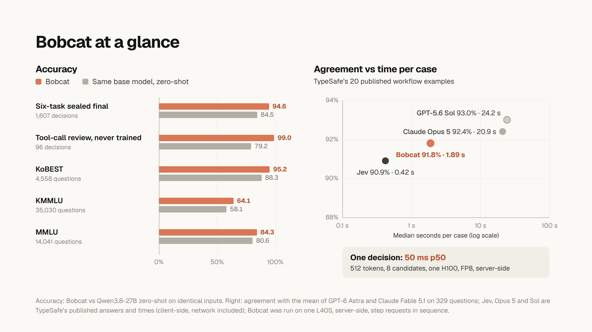

<p align="center">
  <a href="https://foxl.ai"></a>
</p>

<h1 align="center">Bobcat</h1>

<p align="center">
  <strong>A typed-decision model.</strong><br />
  State in, typed decisions out: Choice, Noul and Score, with a probability for every answer you name.<br />
  No generated text, no per-task fine-tuning.
</p>

<p align="center">
  <a href="https://huggingface.co/sanghwa-na/bobcat-1">Model on Hugging Face</a> &nbsp;·&nbsp;
  <a href="https://foxl.ai/blog/bobcat-typed-decisions">Technical report</a> &nbsp;·&nbsp;
  <a href="paper/build/main.pdf">Paper (PDF)</a> &nbsp;·&nbsp;
  <a href="#quickstart">Quickstart</a>
</p>

---



Bobcat reads a state (text or JSON), your questions and the answers you allow, and returns
typed decisions your code can threshold. It reads the logits of the offered candidates at
the first answer position of one forward pass; the host builds a closed JSON reply out of
your own names, and an independent validator refuses anything outside that contract. An
answer can be wrong, but it cannot be malformed.

Bobcat 1 is a rank-16 LoRA adapter for [Qwen3.8-27B](https://huggingface.co/Qwen/Qwen3.8-27B)
(Apache-2.0), released at [sanghwa-na/bobcat-1](https://huggingface.co/sanghwa-na/bobcat-1).
The request and reply use the shapes of TypeSafe's published System One HTTP API, so the
official `typesafe-sdk` works against a Bobcat server by changing its base URL.

| | Bobcat 1 | Reference |
|---|---:|---|
| Six-task decision evaluation, sealed final (1,607 decisions) | **94.6%** | 84.5% same base model, zero-shot |
| Tool-call review, never trained on | **99.0%** | 79.2% same base model, zero-shot |
| TypeSafe's published workflow examples, agreement (329 questions) | **91.8%** | Jev 90.9%, Claude Opus 5 92.4%, GPT-5.6 Sol 93.0% |
| One decision (512 tokens, 8 candidates), p50, server-side | **50 ms** | one H100, FP8, vLLM |

The [model card](release/hf/README.md) and the technical report give every number with
its conditions and limits, including the negative results.

## Quickstart

On one Linux GPU host (tested: one L40S 48 GB with FP8, one H100 80 GB):

```bash
git clone https://github.com/foxl-ai/bobcat && cd bobcat
export UV_PYTHON_PREFERENCE=only-managed   # a uv-managed Python ships the headers Triton compiles against
uv venv --python 3.12 .venv-serve
uv pip install --python .venv-serve/bin/python vllm==0.30.0 fastapi uvicorn scipy jinja2 \
  "tokenizers>=0.21" huggingface_hub typesafe-sdk==0.7.1
export PYTHONPATH=$PWD/src PY=.venv-serve/bin/python

$PY -m bobcat.student_readout download --repo Qwen/Qwen3.8-27B \
  --revision 1d4bf0f2ff6012fd82039f2fa52739d0dd7c60c0 --out base
$PY -c "from huggingface_hub import snapshot_download as s; s('sanghwa-na/bobcat-1', local_dir='adapter')"
$PY -m bobcat.student_merge --model-dir base --adapter adapter --out model
mkdir -p compiler && cp base/{tokenizer.json,tokenizer_config.json,chat_template.jinja,config.json,bobcat-download.json} compiler/

VLLM_USE_FLASHINFER_SAMPLER=0 $PY -m bobcat.api_server --engine vllm --model model \
  --compiler-model compiler --quantization fp8 --temperature 1.1489 --name bobcat-1 \
  --max-num-seqs 128 --host 127.0.0.1 --port 8000 --local
```

Then point the SDK at it: `TYPESAFE_BASE_URL=http://127.0.0.1:8000`,
`TYPESAFE_DEFAULT_MODEL=bobcat-1`, any `TYPESAFE_API_KEY`. See the model card for a full
example and for notes on running on AWS.

## Repository

| Path | What |
|---|---|
| `src/bobcat/protocol.py` | the closed request/response contract, limits and validator |
| `src/bobcat/student_readout.py` | the compiler (single-token identifiers, piecewise encoding) and the first-position readout |
| `src/bobcat/api_server.py` | the TypeSafe-compatible server (vLLM or transformers engine) |
| `src/bobcat/student_train.py`, `student_merge.py` | LoRA training (cross-entropy, Brier, proper-score RL) and merging |
| `src/bobcat/product_eval.py`, `korean_bench.py` | the six-task evaluation builder and the public benchmark sets |
| `scripts/` | calibration, scoring, the TypeSafe workflow comparison, release staging |
| `paper/` | the technical report in LaTeX, its figures and the built PDF |
| `release/` | the release manifest, the model card and its figures |
| `configs/`, `tests/` | pinned data and model sources, and the test suite |

## Development

```bash
uv sync
uv run python -m pytest
uv run ruff check src tests scripts
```

## License

The code is released under the [Apache License 2.0](LICENSE). The Bobcat 1 adapter is
released under Apache-2.0 as a derivative of Qwen3.8-27B. Datasets keep their own licenses;
third-party notices are in [THIRD_PARTY.md](THIRD_PARTY.md) and [licenses/](licenses/).

Bobcat is an independent project. It is not affiliated with or endorsed by TypeSafe AI or
any other company named here; product names are their owners' trademarks and are used only
to identify the models compared.

## Citation

```bibtex
@techreport{bobcat2026,
  title       = {Bobcat: Typed Decisions from One Forward Pass},
  author      = {{The Bobcat Authors}},
  institution = {Foxl AI},
  year        = {2026},
  url         = {https://foxl.ai/blog/bobcat-typed-decisions}
}
```
