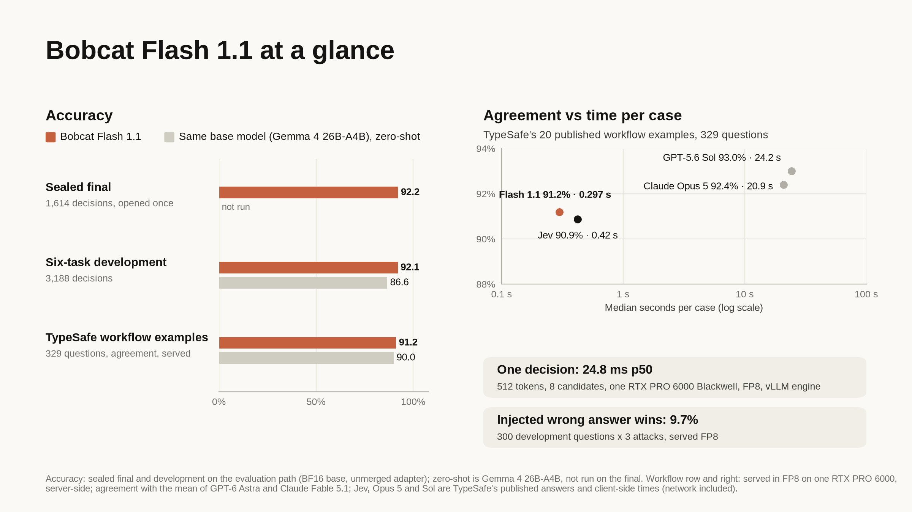

# Bobcat Flash 1.1

Bobcat Flash is the fast tier of Bobcat, a **typed-decision model**. You send a state (text
or JSON) and questions whose possible answers you define in the request; Flash returns a
probability for every answer you named, and nothing else. It never generates text: it
reads the logits of the offered candidates at the first answer position of one forward
pass, and the host builds a closed JSON reply from your own names. An answer can be wrong,
but it cannot be malformed.

This repository, `sanghwa-na/bobcat-flash-1.1`, holds **Bobcat Flash 1.1 as ready-to-serve
BF16 weights**: a rank-64 LoRA distilled from 27B Bobcat teachers onto
[google/gemma-4-26B-A4B-it](https://huggingface.co/google/gemma-4-26B-A4B-it) (Apache-2.0) at
revision `4d7ae4984b7db7de8f8457170b3f1a419ee76d52`, a sparse mixture-of-experts model with
about 4B active parameters per token, merged into the base. vLLM serves it in FP8. It answers
most questions on its own and can hand the ones it is unsure about to
[Bobcat 1.1](https://huggingface.co/sanghwa-na/bobcat-1.1) in the same server. The compiler, servers and evaluation code are at
[github.com/foxl-ai/bobcat](https://github.com/foxl-ai/bobcat).



## Highlights

| | Bobcat Flash 1.1 | Reference |
|---|---:|---|
| Median time per TypeSafe workflow case, client-side over HTTPS (cold server) | **0.25 s** same datacenter; **0.42 s** from another region | Jev 0.42 s (TypeSafe's published client-side time) |
| Same, server-side over localhost | **0.297 s** | one RTX PRO 6000 Blackwell, FP8 |
| One decision (512 tokens, 8 candidates), p50 | **24.8 ms** engine; **27 ms** client-side, same datacenter | one RTX PRO 6000 Blackwell, FP8, vLLM |
| TypeSafe's published workflow examples: agreement with the reference (329 questions) | **91.2%** | Jev 90.9%, Claude Opus 5 92.4%, GPT-5.6 Sol 93.0% |
| SemIf's 102 aligned TypeSafe rows: modal agreement | **0.896** | Jev 0.883 |
| Six-task development evaluation (3,188 decisions) | **92.07%** | same base zero-shot 86.6% (+5.4 pt [+3.7, +7.2]) |
| Sealed final, four tasks (1,614 decisions, opened once) | **92.21%** | the base was not run on this split |
| Wrong answer named inside the state wins (300 questions x 3 attacks) | **9.7%** | served FP8; the base was not run on this test |
| Routed server, development split (Flash first; unsure, out-of-range and over-2,048-token questions to Bobcat 1.1) | **93.15%**, 84.0% answered by Flash | Bobcat 1.1 alone 93.54% |
| Same, states padded to 8K / 16K / 30K tokens | **equal to Bobcat 1.1 alone** (92.0 / 91.3 / 92.7%) | Flash alone -7.3 pt at 30K |

Jev, Opus 5 and Sol figures are TypeSafe's own published answers and times; Jev was never
called. The same-base baseline is untrained Gemma 4 26B-A4B-it with the same compiler and
readout. Flash is weakest on search passage selection and long states; the routed server
sends long, out-of-range and unsure questions to Bobcat 1.1. See
[Limitations](#limitations-and-risks).

## What it does

| Primitive | You define | Bobcat returns |
|---|---|---|
| Choice | 1 to 255 named candidates, descriptions optional | the top name and a probability for every name |
| Noul | optional meanings of true and false | P(true) |
| Score | 1 to 10 ordered levels | the expected level and a probability per level |

The request and reply are the same as Bobcat's and use the shapes of TypeSafe's published
System One HTTP API, so the official `typesafe-sdk` works against a Flash server by changing
its base URL.

## Quickstart: serve Flash on one GPU

The staged files of this repository were load-tested on one RTX PRO 6000 Blackwell 96 GB
with vLLM 0.30.0 by the commands below (the download line runs once the repository is
public): `vllm serve` came up and listed the model; the Bobcat server answered `/health`, the
SDK example below answered `payments`, and TypeSafe's 20 workflow cases agreed with the
reference on 91.2% of 329 questions (no failed request) at 0.28 s per case. The other figures
on this card were measured on the same GPU type with vLLM 0.30.0 and FP8.

```bash
curl -LsSf https://astral.sh/uv/install.sh | sh && export PATH="$HOME/.local/bin:$PATH"   # uv
git clone https://github.com/foxl-ai/bobcat && cd bobcat
export UV_PYTHON_PREFERENCE=only-managed   # a uv-managed Python ships the headers Triton compiles against
uv venv --python 3.12 .venv-serve
uv pip install --no-config --python .venv-serve/bin/python vllm==0.30.0 fastapi uvicorn scipy jinja2 \
  "tokenizers>=0.21" huggingface_hub typesafe-sdk==0.7.1
export PYTHONPATH=$PWD/src PY=.venv-serve/bin/python

# These weights (about 52 GB), then the typed-decision server
# (TypeSafe-compatible /v1/systemone and /v1/models), FP8 at load
$PY -c "from huggingface_hub import snapshot_download as s; s('sanghwa-na/bobcat-flash-1.1', local_dir='bobcat-flash-1.1')"
VLLM_USE_FLASHINFER_SAMPLER=0 $PY -m bobcat.flash_server --engine vllm --model bobcat-flash-1.1 \
  --compiler-model bobcat-flash-1.1/compiler --quantization fp8 --temperature 0.8912 \
  --name bobcat-flash-1.1 --release-date 2026-09-26 --max-num-seqs 256 --max-model-len 32832 \
  --schedule all --engine-arg max_num_batched_tokens=16384 --host 127.0.0.1 --port 8000 --local
```

Then call it with the official SDK:

```python
import os
os.environ.update(TYPESAFE_BASE_URL="http://127.0.0.1:8000", TYPESAFE_API_KEY="local",
                  TYPESAFE_DEFAULT_MODEL="bobcat-flash-1.1")
from typesafe_sdk import Choice, Noul, TypeSafeClient

client = TypeSafeClient()
result = client.system_one(
    "I was charged twice for the same order. Can someone look into this?",
    {"billing": Noul(instructions="Is this about billing?"),
     "route": Choice(instructions="Which team should handle it?",
                     criteria={"payments": "Charges and refunds", "shipping": None,
                               "account": "Login and settings"})},
)
print(result.nouls["billing"].noul, result.choices["route"].choice)
```

Notes:

- `vllm serve sanghwa-na/bobcat-flash-1.1 --quantization fp8 --max-model-len 32832` also loads
  these weights, but plain vLLM exposes text generation; the typed-decision contract (closed
  JSON replies, no generated tokens) comes from the Bobcat servers.
- `--quantization fp8` is vLLM's online dynamic FP8 of these BF16 weights, the served
  configuration.
- `--no-config` keeps uv from applying this repository's development settings to the
  serving environment: `pyproject.toml` constrains setuptools to >= 83, and vLLM 0.30.0
  requires setuptools < 81.
- `--temperature 0.8912` is the calibration temperature fitted for this model on a
  held-out calibration split; it never changes an argmax.
- `bobcat.api_server` with the same arguments serves Flash too; it tokenizes the state once
  per request and produced the same token IDs on 3,606 questions.
- vLLM runs Gemma 4 with its Triton attention backend (head sizes 256 and 512).
- `--local` disables the shared secret the servers otherwise require; use it only on a
  loopback or private interface. The server refuses inputs over its limits with HTTP 422
  and never truncates them.
- `--compiler-model bobcat-flash-1.1/compiler` points the Bobcat compiler at the base
  model's pinned tokenizer, template and configuration; it checks them against the download
  receipt in that folder.
- The compiler reads its identifier list from the repository
  (`reports/2026-09-22-glm-readout-preflight.json`), so run the server from the repository
  root, or pass `--identifiers bobcat-flash-1.1/bobcat-identifiers.json`: the same list ships
  here.

## Routing to Bobcat 1.1

`bobcat.route_server` runs Flash and Bobcat 1.1 as two vLLM engines in one process on one
GPU and decides for each question on its own, from that question's input and Flash's scores
only:

1. **Out of range, before any forward pass:** more than 64 candidates, or fewer than half
   of the letters Hangul or Latin (Flash was trained and evaluated on Korean and English
   only).
2. **Too long, before any forward pass:** the question's Flash-compiled sequence (its
   state plus the question) is longer than 2,048 Flash tokens (`--max-flash-tokens`,
   default 2048; `0` turns the rule off). Flash loses accuracy as the state grows (see
   [Long inputs](#long-inputs)); Bobcat 1.1 keeps it.
3. **Otherwise Flash scores it.** If Flash's calibrated top probability is below 0.8 (a
   threshold chosen on the calibration split), Bobcat 1.1 compiles and scores it again.

Questions sent on by the first two rules start on Bobcat 1.1 at once, beside the Flash pass.
Each answer carries the probabilities of the model that scored it, at that model's
calibration temperature, and the `x-bobcat-route` header names that model per question.
Questions never see each other: a long question does not move the short questions of the
same request.

The 2,048 threshold was chosen on the development split only, by a rule written down before
any score existed: the largest threshold at which routed accuracy stays within 1 point of
Bobcat 1.1 alone at every padded state length from 0 to 8K tokens (only 1,024 and 2,048
qualified). A separate 300-question development holdout was scored for the record and did
not change it: at 3K-8K it matches Bobcat 1.1; unpadded and at 1K it is 1.3 points (4 of 300
questions) below, from the confidence rule, which the length rule does not touch there.

This is the configuration we measured and serve: one 96 GB Blackwell GPU (RTX PRO 6000),
Flash in FP8 with 40% of GPU memory and Bobcat 1.1 as its ready-to-serve NVFP4 checkpoint
([sanghwa-na/bobcat-1.1-nvfp4](https://huggingface.co/sanghwa-na/bobcat-1.1-nvfp4)) with
46%. `nvidia-smi` showed about 82,500 MiB in use once both engines had started and 86,500
MiB after the measurements below, of 97,887 MiB. A BF16 merge of Bobcat 1.1 (about 54 GB) does not fit in its 46% share,
and serving both models in FP8 has not been measured with this server.

```bash
# Flash as in the quickstart (bobcat-flash-1.1/); Bobcat 1.1 as its NVFP4 checkpoint:
$PY -c "from huggingface_hub import snapshot_download as s; s('sanghwa-na/bobcat-1.1-nvfp4', local_dir='bobcat-1.1-nvfp4')"
VLLM_USE_FLASHINFER_SAMPLER=0 $PY -m bobcat.route_server \
  --flash-model bobcat-flash-1.1 --flash-compiler-model bobcat-flash-1.1/compiler --flash-temperature 0.8912 \
  --flash-quantization fp8 --flash-gpu-memory-utilization 0.40 \
  --big-model bobcat-1.1-nvfp4 --big-compiler-model bobcat-1.1-nvfp4/compiler \
  --big-quantization none --big-temperature 1.2008 --big-gpu-memory-utilization 0.46 \
  --max-flash-tokens 2048 --max-model-len 32832 --schedule all \
  --engine-arg max_num_batched_tokens=16384 --host 127.0.0.1 --port 8000 --local
```

Measured with Flash in FP8 and that NVFP4 checkpoint (`model.safetensors` sha256
`2ea6716e…73c9`), one request at a time over loopback HTTP on the server host:

| Input (Flash tokens) | Questions | **Routed** | Flash alone | Bobcat 1.1 alone | Answered by Flash | Latency p50: routed / Flash / Bobcat 1.1 |
|---|---:|---:|---:|---:|---:|---|
| Development split, unpadded | 3,188 | **93.15%** | 92.16% | 93.54% | 84.0% | 33 / 32 / 61 ms |
| State padded to 8K | 300 | **92.0%** | 86.0% | 92.0% | 0% | 452 / 276 / 436 ms |
| State padded to 16K | 300 | **91.3%** | 84.3% | 91.3% | 0% | 952 / 703 / 951 ms |
| State padded to 30K | 300 | **92.7%** | 83.7% | 92.7% | 0% | 1,990 / 1,801 / 1,982 ms |

The unpadded split is scored by task macro and the padded levels by accuracy (50 questions
per task, so the two coincide). **The routed service matches Bobcat 1.1 alone at 8K, 16K
and 30K**: every padded question goes to Bobcat 1.1, so the answers are the same. On the
unpadded split, routed minus Bobcat 1.1 alone is -0.39 points [-0.81, +0.00], and the length
rule moves no question there (every question over 2,048 tokens already had more than 64
candidates). No request failed, and the two engines ran every block on the 96 GB GPU without
running out of memory; concurrent load has not been tested.

**The price of the rule is Flash's share on long workflows.** 71.5% of the questions in
TypeSafe's 20 workflow cases are longer than 2,048 Flash tokens (median 5,268), so the routed
server answers only 21.5% of them with Flash. It agreed with the reference on **91.8%** of the
329 questions (workflow mean 88.2%, Jev 86.5%) at a median **0.48 s per case**, against
91.5% and 0.53 s for routing without the length rule in the same session: long questions
skip the Flash pass. **Where time per case matters most, serve Flash alone** (0.25 s per case
client-side, see [Latency](#latency)) and keep long states off it.

## Running on AWS

These are ordinary GPU Linux hosts; the Quickstart above is the whole recipe.

- **Amazon EC2.** One RTX PRO 6000 Blackwell 96 GB (for example `g7e.2xlarge`) serves these
  weights in FP8, and holds Flash and Bobcat 1.1 (NVFP4) together for the routed server. Use
  a Deep Learning AMI with a recent NVIDIA driver, and allow about 80 GB of disk for Flash
  alone, about 30 GB more for the Bobcat 1.1 NVFP4 checkpoint.
- **Amazon SageMaker AI.** The same commands run in a JupyterLab space or notebook
  instance of an equivalent GPU type. A SageMaker real-time endpoint needs a custom
  container that runs `bobcat.flash_server` or `bobcat.route_server` behind SageMaker's
  `/invocations` and `/ping` routes; we have not published or tested one.

Our measurements ran on an EC2 RTX PRO 6000 host, with H200 and B200 figures from 8-GPU
hosts (one GPU per server). The SageMaker paths are described here but not tested by us.

## Evaluation

Differences are paired, with 95% bootstrap intervals over source components (TypeSafe
workflows: over cases). The development and sealed-final figures use the evaluation path
(BF16 base with the unmerged adapter); TypeSafe, SemIf and injection figures use these
merged weights served in FP8 over HTTP.

### Sealed final

A fresh final built from KLUE MRC contexts and Wizard of Seoul dialogues that no evaluation
split, other final or training build used (1,614 decisions, four tasks). Flash opened it
once, under an authorization recorded with a frozen manifest before the split was opened.
The untrained Gemma base was not run on this split.

| Task (decisions) | Flash 1.1 |
|---|---:|
| Search passage selection (500) | 74.6% |
| Citation verification (103) | 100.0% |
| External document screening (550) | 94.9% |
| Request routing (461) | 99.3% |
| **Task macro** | **92.21%** |

51 routing questions share Wizard of Seoul utterances with the Flash corpus; without them
Flash scores 92.19%. After
temperature, NLL is 0.432 and ECE 0.019. No request failed. The evaluation is Korean and no
label has been reviewed by a person.

### Six-task development evaluation

The v2 development split (3,188 Korean decisions). It was used to select the arm, so it is
not a held-out test.

| Task | Flash 1.1 | Same base (Gemma 4 26B-A4B-it), zero-shot |
|---|---:|---:|
| Search passage selection | **88.4%** | 84.8% |
| Citation verification | **99.8%** | 96.5% |
| Tool-call review, never trained | **92.8%** | 82.3% |
| External document screening | **94.7%** | 88.9% |
| Request routing | **99.6%** | 98.7% |
| Classification | **77.0%** | 68.6% |
| **Task macro** | **92.07%** | 86.6% |
| NLL / ECE | 0.285 / 0.011 | 1.912 / 0.122 |

Flash minus its base zero-shot: +5.4 points [+3.7, +7.2]. The base alone is over-confident
(fitted temperature 5.28); Flash's fitted temperature is 0.89.

### TypeSafe's published workflow examples

TypeSafe publishes 20 workflow examples at [evals.typesafe.ai](https://evals.typesafe.ai)
with the state, the exact questions, the answers of Claude Opus 5, GPT-5.6 Sol and Jev, and
reference answers from GPT-6 Astra and Claude Fable 5.1. We sent the same requests once to
the served FP8 Flash and scored every model with the same code on the 329 questions all
four answered; no request failed or was retried.

| | Flash 1.1 | Jev | Claude Opus 5 | GPT-5.6 Sol | Gemma 4 26B-A4B zero-shot |
|---|---:|---:|---:|---:|---:|
| Agreement with the reference, all questions | 91.2% | 90.9% | 92.4% | 93.0% | 90.0% |
| Agreement, mean of the four workflows | 85.4% | 86.5% | 88.2% | 89.6% | 82.4% |
| Probability on the reference answer | 0.862 | 0.850 | 0.851 | 0.914 | 0.899 |
| Median time per case | 0.297 s | 0.42 s | 20.9 s | 24.2 s | 0.293 s |

Flash minus Jev, averaged over workflows, is -1.0 points [-4.6, +4.2]: level on these
examples, not separated. This is question-level agreement on 20 English cases against a
frontier-model consensus, not action accuracy or ground truth. Flash's time is server-side
over localhost HTTP on one RTX PRO 6000 (a second host measured 0.283 s); the other times
are TypeSafe's published client-side times with the network included.

### SemIf benchmark bundle

[SemIf](https://github.com/TheoLeeCJ/SemIf-OpenJev) (MIT) publishes typed-decision rows and
evaluators, plus the Jev figures TypeSafe released for 102 rows aligned to its workflow
cases, scored here with SemIf's unmodified evaluators.

| Set (metric) | Flash 1.1 | Jev (published) |
|---|---:|---:|
| authored144 (mean family balanced accuracy) | 0.900 | - |
| perturbations108 | 0.952 | - |
| WANLI256 | 0.734 | - |
| TypeSafe102 modal agreement / total variation | **0.896** / 0.110 | 0.883 / 0.127 |
| Every judge-grid (36 cells) | 31 | 32 |
| Every action-firewall (10 actions) | 9 | 10 |

Bobcat 1.1 scores 0.910, 0.989, 0.730 and 0.872 on the first four rows. These sets are
evaluation-only; none of their rows was used for training, selection or calibration.

### Wrong answers named inside the state

300 development questions, each sent clean and with three attacks (1,200 HTTP requests).

| | Flash 1.1 |
|---|---:|
| **Attack success** | **9.7%** |
| Accuracy: clean / administrator verdict / inside the text / note to an AI grader | 92.7 / 84.3 / 84.0 / 84.3% |
| Replies outside the output contract (independent wire check) | 0 |

The untrained base was not run on this test.

### Long inputs

300 development questions (50 per task), with the state padded by unrelated passages to a
length counted in Flash tokens; served FP8 path:

| State length | Flash 1.1 | Change [95%] | Same base, zero-shot | Change |
|---|---:|---|---:|---:|
| Unpadded | 92.0% | - | 85.7% | - |
| 8K tokens | 86.7% | -5.3 [-9.1, -1.8] | 78.7% | -7.0 |
| 16K tokens | 85.3% | -6.7 [-11.9, -1.9] | 79.0% | -6.7 |
| 30K tokens | 84.7% | **-7.3 [-12.6, -2.8]** | 78.3% | -7.3 |

Most of the drop is in tool-call review (92% to 70% at 30K) and classification (74% to 58%).
BF16 weights lose as much (-7.7 at 30K), so FP8 is not the cause, and the untrained base
loses the same 7.3 points; Flash's training corpus had no padded long rows. **The routed
server sends every question longer
than 2,048 Flash tokens to Bobcat 1.1** and then matches it at 8K, 16K and 30K (see
[Routing](#routing-to-bobcat-11)). With `--max-model-len 32832` Flash accepts up to 32,768
Flash tokens per compiled question (one 32,704-token request took 1.90 s); Gemma's tokenizer
counts about 8% more tokens than Bobcat's on these rows, and longer requests are refused,
never truncated.

### Latency

| One RTX PRO 6000 Blackwell 96 GB, vLLM 0.30.0, FP8, engine (no HTTP) | Flash 1.1 |
|---|---:|
| 512 tokens, 8 candidates, 1 question, p50 / p95 | 24.8 / 25.2 ms |
| 3.2k-token state, 8 questions, one batch, p50 | 196 ms |
| 8K / 16K tokens, 1 question, p50 | 272 / 682 ms |
| Throughput, independent 1K-token requests | 48,750 tokens/s |
| TypeSafe workflow case, served over localhost HTTP: median / mean / Invoice median | 0.297 / 0.62 / 1.50 s |

The same architecture, measured with a checkpoint from the first training stage, took 15.9 ms (first profile) and
0.185 s per workflow case on one H200, and 13.7 ms and 0.226 s on one B200.

**Client-side.** A separate client host over HTTPS, one reused connection, one request at a
time, to `bobcat.flash_server` (FP8, `--schedule all`) behind a TLS proxy on one RTX PRO
6000; no request failed:

| p50 | Same datacenter | Another region (51 ms TCP round trip) |
|---|---:|---:|
| One decision (512 tokens, 8 candidates) | 27.3 ms | 77.7 ms |
| 3 questions on one state | 28.1 ms | 78.5 ms |
| 21 questions on one state | 57.3 ms | 103.4 ms |
| TypeSafe workflow case, median: cold server / repeated pass | **0.25** / 0.10 s | **0.42** / 0.23 s |
| Invoice workflow case, median, cold server | 1.50 s | 1.71 s |

In the same datacenter the network adds about 1 ms per request; from another region each
request adds one round trip. "Cold" is the first pass after the server starts, with an empty
prefix cache; the repeated pass resends the same 46 requests, so most of each prompt comes
from the cache and that figure is an upper bound on the cache's gain. TypeSafe does not say
where or with what cache state it measured Jev's 0.42 s, so this is not a like-for-like
comparison, and the question-heavy Invoice cases stay slower than Jev's published 0.45 s.
Latency under concurrent HTTP load has not been measured.

### Serving precision

**These weights and the adapter path.** On a development sample (every 10th decision of the
v2 development split, 319 decisions across the six tasks), these merged BF16 weights and the
evaluation path (BF16 base with the unmerged adapter, the same code, one RTX PRO 6000) gave the
same top answer on 314 (98.4%) and the same accuracy (291 of 319 correct, 91.2%); the five
changed answers were all search near-ties (top two within 0.08). The shards are
byte-identical to the merge behind every served figure on this card.

Served in FP8, Flash gives the evaluation path's answer on 98.4% of development questions (task
macro 92.1% to 91.8%). An NVFP4 build (every expert quantized) was **slower and less
accurate** on this GPU: 44,012 against 48,594 tokens/s, -0.68 points [-1.59, +0.14] on
development and 89.1% against 91.2% on TypeSafe's workflows. Serve FP8.

## Training and distillation

- **Base:** Gemma 4 26B-A4B-it at revision `4d7ae4984b7db7de8f8457170b3f1a419ee76d52`: 30
  layers of sliding-window (1,024) and global attention, 128 experts with 8 active plus a
  dense MLP, about 4B active parameters. It had the highest zero-shot development macro of
  the candidates we compared (86.6%, against 85.5% for the 27B Bobcat base).
- **Adapter:** LoRA rank 64, alpha 128, no dropout, on the attention q/k/v/o projections
  (the five global layers have no v projection), the dense MLP and the expert router of all
  30 layers; 80.0M trainable parameters. The 128 experts, embeddings and output head are
  frozen.
- **Teachers:** two Bobcat LoRA adapters of Qwen3.8-27B, each merged and read once over the
  whole corpus with the served readout: teacher A (adapter sha256 `2704495d…`, temperature
  1.149) and teacher B, the stage-1 adapter of Bobcat 1.1 (`33a323d1…`, temperature 1.188).
  The teachers never saw the gold labels.
- **Loss per question:** KL(teacher || student) at the teacher's calibration temperature,
  plus 0.5 times the gold loss (cross-entropy for Choice and Noul, expected-level error for
  Score) where a gold label exists.
- **Stages** (eight NVIDIA B200 GPUs, AdamW with betas 0.9/0.95, 3% warmup, cosine decay to
  10%, gradient clip 1.0):

  | Stage | Data | Teacher | Learning rate | Steps |
  |---|---|---|---:|---:|
  | 1 | whole corpus, one epoch | A | 2e-4 | 1,401 |
  | 2 | whole corpus, half an epoch | B | 1e-4 | 700 |
  | 3 | teacher A's training mixture, one epoch, gold plus teacher | B | 5e-5 | 214 |

- **Corpus (447,904 questions, 257,710 source components; frozen once):**

  | Source | Questions | Gold label |
  |---|---:|---|
  | Teacher A's training mixture (KLUE MRC, Wizard of Seoul, policy transfer, public data) | 50,409 | yes |
  | Further public decisions (KorNLI; KLUE NLI, YNAT, STS; NSMC; HelpSteer 2 and 3; MASSIVE; Banking77; BoolQ; ARC) | 158,298 | yes |
  | New questions on the same public states (evidence/claim, topic, urgency, answerability) | 94,041 | partly |
  | Generated workflows and games (invoices, security logs, support tickets, tic-tac-toe, grid paths, a shooter's strategy sentences, link races) | 97,297 | partly |
  | English NLI (MultiNLI, SNLI) | 33,003 | yes |
  | Policy transfer (synthetic rules with exact interpreters) | 14,856 | yes |

  369,418 questions have a gold label and 78,486 carry only teacher probabilities; 165,719
  (37%) are English.
- **Calibration:** one temperature, 0.8912, fitted on the held-out calibration split.
- **Merge:** the adapter (`adapter_model.safetensors` sha256 `2304bd8e…9ca3`) merged into the
  base with `bobcat.student_merge` in the serving environment (vLLM 0.30.0, torch 2.13.0): each
  of the 235 adapted weights becomes `bf16(W + (alpha/r) B A)` (alpha/r = 2.0) with the product
  and sum in float32; the 128 experts and every other tensor are copied. Shard hashes:
  `model-00001-of-00002.safetensors` `6847aa86…a14a7`, `model-00002-of-00002.safetensors`
  `d72e4385…bb72a`, in `SHA256SUMS.json` and the release manifest
  (`serving_artifacts.merged_bf16`).
- **Selection:** the arm with the highest development macro among the Gemma 4 26B-A4B arms.
  TypeSafe, SemIf and injection results were not used to select.
- **Provenance:** **No output of Jev was used for training, distillation, reward or
  calibration**; the only teachers were the two Bobcat adapters above, and no GLM teacher was
  run. No TypeSafe, SemIf, Every or cookbook evaluation row was used: rows matching any of
  4,495 strings of 16 characters or more from those sets were blocked (none matched), as
  were rows sharing text with the development, calibration or final splits. Tool-call review
  was never trained.

## Limitations and risks

- **Lower search accuracy.** Search passage selection is Flash's weakest task: 74.6% on the
  sealed final and 88.4% on development, where title matching with 77 to 255 candidates falls
  most. The routed server sends questions with more than 64 candidates to Bobcat 1.1.
- Classification (77.0% on development) is the other weak task.
- **Multi-question requests.** Gemma 4's sliding-window layers keep vLLM's prefix cache from
  reusing a shared state exactly, so a request with many questions recomputes part of its
  state (about 1.6 times the request's tokens on a 37-state, 777-question benchmark).
- **Near-ties move between server runs.** Two fresh installs of the served FP8 model
  scored 90.9% and 91.8% on TypeSafe's 329 workflow questions: 6 top answers changed, each
  with a top probability of 0.70 or less. Where an answer must be reproducible, send
  questions below Flash's 0.8
  threshold to Bobcat 1.1, as `bobcat.route_server` does.
- Insufficient evidence is hard (WANLI256 0.734). Give it an explicit "not stated" option.
- **Long states.** On its own, Flash loses 7.3 points at a 30K-token state and 5.3 already
  at 8K (see [Long inputs](#long-inputs)). Serve long inputs through the routed server,
  whose length rule sends them to Bobcat 1.1, or through Bobcat 1.1 directly. With the rule,
  long workflows are answered mostly by Bobcat 1.1 (78.5% of TypeSafe's questions), at its
  speed.
- **Two long-context continuations failed and were not released.** We continued this
  adapter on 2,400 padded rows (4K-30K tokens) plus replay, distilled from the released
  Bobcat 1.1, under four conditions written down before training: 30K change of at least
  -2.0 points on the served path, development macro of at least 91.77%, TypeSafe agreement
  of at least 90.19%, injection success of at most 10%. The first arm (learning rate 5e-5)
  lost 4.7 points at 30K [-9.7, -0.4], and fell to 91.44% on development and 89.97% on
  TypeSafe (injection 7.5%). The second (2e-5, twice the replay) kept 92.20%, 91.19% and
  7.7% but still lost 4.3 points at 30K [-9.6, +0.4]. Neither met all four, so Flash 1.1 is
  unchanged; the drop on tool-call review, which was never trained, did not shrink in either.
- The routed server's two engines share one GPU; they ran every measurement without running
  out of memory, but concurrent load has not been tested, and out-of-range inputs in other
  scripts were never probed.
- The development split and the sealed final are Korean; English results come from
  TypeSafe's 20 cases, SemIf and training monitors. The final has no classification or
  tool-call rows.
- A typed answer can be the wrong valid option, and `confidence` is a concentration
  statistic, not the probability of being right. Arithmetic, counting and date comparison
  are weak; compute them in code.

**Intended use:** small, repeated judgments whose admissible answers the application owns,
where time per request matters - routing, guardrail screening, citation checks, tool-call
review, classification - with the policy that acts on the answer kept in the application's
code. **Out of scope:** generating text, open-ended question answering, and sole reliance on
Bobcat Flash for safety-critical or legal decisions.

## License and attribution

These weights are released under Apache-2.0 as a derivative of Gemma 4 26B-A4B-it by Google
DeepMind, which is released under the Apache License 2.0 (the pinned revision's card metadata
and its linked [Gemma 4 license](https://ai.google.dev/gemma/docs/gemma_4_license) page,
checked on 2026-09-26); the license text is included as `LICENSE`, and `NOTICE` lists what
was changed. Its teachers are Apache-2.0 Bobcat adapters of Qwen3.8-27B (Apache-2.0). Training data keep their own licenses: KLUE, KorNLI, ARC and SNLI
(CC BY-SA 4.0), BoolQ (CC BY-SA 3.0), NSMC (CC0 1.0), MASSIVE, Banking77 and HelpSteer 2 and 3
(CC BY 4.0), and MultiNLI (mostly the Open American National Corpus license, with fiction
under CC BY-SA 3.0 and CC BY 3.0). Attributions are in the code repository's
`THIRD_PARTY.md`.

Bobcat is an independent project. It is not affiliated with or endorsed by TypeSafe AI,
Google, the Qwen team, Anthropic, OpenAI, Every or any other company named here; product
names are their owners' trademarks and are used only to identify the models compared.
TypeSafe's and SemIf's evaluation data are not redistributed here. The weights are provided
as is, without warranty.

## Citation

```bibtex
@misc{bobcatflash11,
  title        = {Bobcat Flash 1.1},
  author       = {{The Bobcat Authors}},
  year         = {2026},
  howpublished = {\url{https://huggingface.co/sanghwa-na/bobcat-flash-1.1}}
}
```
